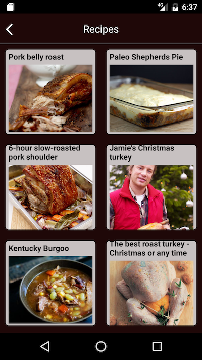

#  WhatToCook

## Tech used:
* language: Javascript
* template: [Ignite](https://github.com/infinitered/ignite)
* engine: [React Native](https://facebook.github.io/react-native)
* state manager: [Redux](http://redux.js.org)
* recipes API: [Food2fork](http://food2fork.com)
* platform: Android & IOS

## :arrow_forward: Screenshots:

**Main:**

**Results:**

**When results are not found:**

## :arrow_forward: Notes:

This application has not been deployed to the Google Playstore or Apple Store.

You can find a snapshot of the Android version in the [release page](https://github.com/kriskate/WhatToCook/releases)
